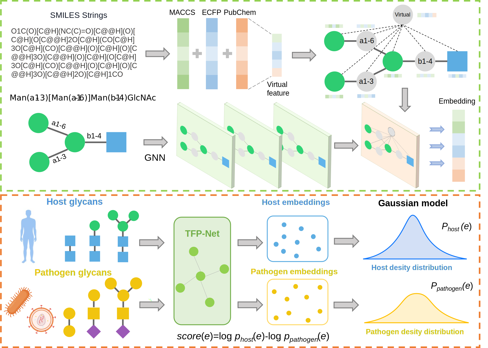

<div align="center">

# TFP-Net: A Topology–Fingerprint Fusion Network for Glycan Embedding and Application

*Learning informative representations of glycans by jointly encoding glycan graph topology and molecular fingerprints.*

</div>

<p align="center">
  
</p>

This repository accompanies the manuscript draft *Gly_embedding_with_application_SLM.pdf*
(preprint, included in this directory).

---

## Overview

Glycans are branched carbohydrate structures whose biological function is jointly determined by
their **connectivity/topology** (which monosaccharides link to which, and how) and their
**local chemical environment** (functional groups, stereochemistry). **TFP-Net** learns glycan
embeddings by fusing two complementary views of the same molecule:

- a **topological view**, in which the glycan is treated as a graph of monosaccharide/linkage
  nodes and encoded with a graph neural network, and
- a **fingerprint view**, in which the glycan is converted to SMILES and described by classical
  molecular fingerprints.

The resulting embeddings support downstream tasks such as **taxonomic (kingdom) classification**,
**host–pathogen discrimination**, **immunogenicity** analysis, and a **density-based risk score**
that quantifies how "human-like" versus "immunogenic-pathogen-like" a glycan is.

## Highlights

- **Dual-view fusion** of glycan graph topology (T) and molecular fingerprints (FP).
- **Two ablation models** (T-Net and FP-Net) isolating the contribution of each view.
- **Three fingerprint families** (MACCS, Morgan/ECFP, PubChem) with optional chirality encoding.
- **Unsupervised risk scoring** via Gaussian Mixture density estimation of the embedding space.
- **Interactive web visualizations** of the learned embedding space (Plotly), included as
  self-contained HTML pages.

---

## Repository structure

```
a_github/
├── proprecess/                 # Data-processing pipeline
│   ├── smiles.py               #   glycan sequence  → SMILES  (batch, via glyles)
│   ├── fingerprint.py          #   SMILES           → molecular fingerprints
│   └── sigmod_risk.py          #   risk score       → sigmoid-normalized to [-1, 1]
├── model/                      # Models
│   ├── TFP-Net.py              #   main model: topology + fingerprint fusion
│   ├── T-Net.py                #   ablation: topology (graph) only
│   ├── FP-Net.py               #   ablation: fingerprint only
│   ├── TFP-Net-imm.py          #   TFP-Net variant for immunogenicity
│   └── GMM.py                  #   GMM density model → embedding risk score
├── data/                       # Input data (glycan sequences, embeddings, fingerprints)
├── output/                     # Generated outputs (embeddings, risk scores, …)
├── weights/                    # Pretrained model weights (.pt / .pth)
├── MD/                         # Molecular-dynamics docking conformations (glycan–protein, .pdb)
├── html/                       # Interactive embedding visualizations (our web app)
├── Gly_embedding_with_application_SLM.pdf   # Manuscript draft (preprint)
└── 图片1.svg                   # Main figure (Figure 1)
```

---

## Pipeline

### 1 · Preprocessing (`proprecess/`)

| Script | Role |
| ------ | ---- |
| **`smiles.py`** | Batch-converts glycan sequences into **SMILES** strings using [`glyles`](https://github.com/kalininalab/GlyLES). Reads a target column from a CSV and writes a new `smiles` column. |
| **`fingerprint.py`** | Generates **three fingerprints** from each SMILES — **MACCS keys**, **Morgan / ECFP** (configurable radius and bit length, with an optional **chirality** flag `useChirality`), and **PubChem** fingerprints — and concatenates them into a single feature vector. |
| **`sigmod_risk.py`** | Rescales the raw risk score to the interval **[-1, 1]** with a sigmoid mapping (adjustable steepness `k`), keeping 0 fixed as the neutral point. |

### 2 · Models (`model/`)

| Model | Description |
| ----- | ----------- |
| **TFP-Net** (`TFP-Net.py`) | **Main model.** Fuses the graph-topology encoder and the fingerprint encoder into a single embedding for classification/representation. |
| **T-Net** (`T-Net.py`) | **Ablation — topology only.** Uses just the glycan graph (GNN) branch. |
| **FP-Net** (`FP-Net.py`) | **Ablation — fingerprint only.** Uses just the molecular-fingerprint branch. |
| **TFP-Net-imm** (`TFP-Net-imm.py`) | TFP-Net configured for the **immunogenicity** task. |

### 3 · Risk scoring (`model/GMM.py`)

Fits reference density models over the learned embedding space with **Gaussian Mixture Models**
(component count selected automatically by BIC; StandardScaler + whitened PCA preprocessing).
Two reference distributions are estimated — **human (`Homo sapiens`)** and
**immunogenic pathogen** — and each glycan is scored by the **log-likelihood ratio** between them,
yielding an interpretable "human-like ↔ pathogen-like" risk score.

### 4 · Structural context (`MD/`)

`.pdb` files contain **docked conformations of glycan–protein complexes** obtained from molecular
dynamics, providing structural context for selected glycans (e.g., isomer pairs, immunogenic vs.
non-immunogenic examples).

---

## Interactive web application (`html/`)

To make the learned representations explorable, we built an **interactive web app** that renders
the glycan embedding space as zoomable **Plotly** scatter plots. Each page is a
**self-contained HTML file** — open it directly in any modern browser, no server required.

Beyond showing the **clustering structure** of the embeddings, the pages are fully interactive:
**hovering over any point reveals the detailed information of that specific glycan** (e.g., its
sequence and metadata), so individual glycans — not just the overall clusters — can be inspected
directly in the browser.

| Page | What it shows |
| ---- | ------------- |
| `TFP-Net-kingdom.html` | Embedding space colored by **taxonomic kingdom**. |
| `Host-Pathogen.html`   | Embedding space colored by **host vs. pathogen** origin. |
| `TFP-Net-isomers.html` | Focused view of **isomer** glycans in the embedding space. |

---

## Requirements

The code was developed and tested with **Python 3.9+** and **PyTorch 2.1.0 (CUDA 12.1)**.
Key dependencies:

| Category | Packages |
| -------- | -------- |
| Deep learning | `torch==2.1.0+cu121`, `torch-geometric==2.6.1`, `torch-scatter`, `torch-sparse`, `torch-cluster`, `torch-spline-conv` |
| Cheminformatics | `rdkit==2024.9.6`, `glyles==1.2.2` |
| ML / stats | `scikit-learn==1.6.1`, `scipy`, `numpy==1.26.3`, `pandas==2.2.3`, `statsmodels`, `optuna` |
| Visualization / web | `plotly`, `matplotlib`, `seaborn`, `dash`, `dash-bootstrap-components`, `gunicorn` |
| Graphs / utils | `networkx`, `pydot`, `tqdm`, `joblib` |

A minimal install:

```bash
# 1) PyTorch + PyG (match your CUDA version — example: CUDA 12.1)
pip install torch==2.1.0 --index-url https://download.pytorch.org/whl/cu121
pip install torch-geometric torch-scatter torch-sparse torch-cluster torch-spline-conv \
    -f https://data.pyg.org/whl/torch-2.1.0+cu121.html

# 2) Cheminformatics + ML stack
pip install rdkit glyles scikit-learn numpy pandas matplotlib seaborn plotly optuna joblib networkx tqdm
```

---

## Quick start

```bash
# 1) Glycan sequences → SMILES
cd proprecess
python smiles.py

# 2) SMILES → fingerprints
python fingerprint.py

# 3) Train / embed with a model
cd ../model
python TFP-Net.py          # main model
# python T-Net.py          # ablation: topology only
# python FP-Net.py         # ablation: fingerprint only

# 4) Fit reference densities and compute the risk score
python GMM.py
cd ../proprecess
python sigmod_risk.py      # normalize risk score to [-1, 1]
```

> Input/output paths are set near the top of each script — adjust them to your local layout.

---

## Citation

If you find this work useful, please cite the accompanying manuscript:

```bibtex
@article{TFPNet,
  title  = {Glycan Embedding with Application: A Topology–Fingerprint Fusion Network},
  author = {SLM and collaborators},
  year   = {2025},
  note   = {Manuscript in preparation. See Gly_embedding_with_application_SLM.pdf.}
}
```

## Acknowledgements

The graph-topology branch builds on the glycan graph-encoding ideas from
[**SweetNet**](https://github.com/BojarLab/glycowork). Fingerprint utilities adapt PubChem SMARTS
patterns from **PyBioMed**.

## License & contact

This repository is released for peer review and demonstration purposes. Please contact the
authors regarding reuse, collaboration, or access to the full pipeline.
